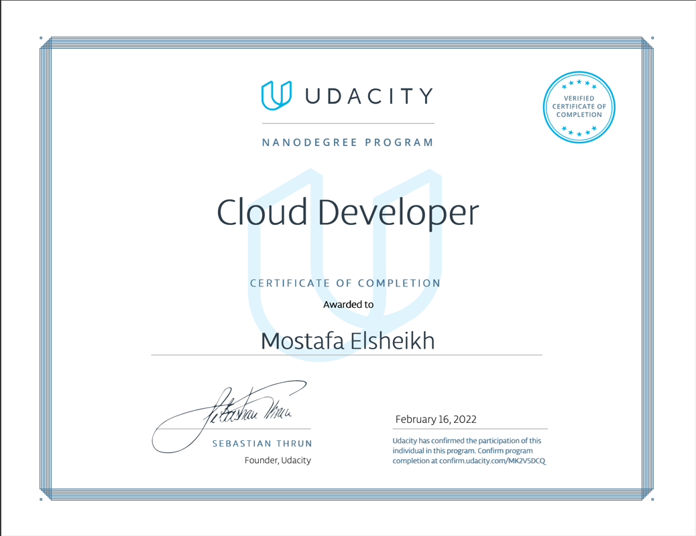

# Udacity Cloud Developer Nanodegree

My project work for the [Cloud Developer Nanodegree by Udacity](https://www.udacity.com/course/java-developer-nanodegree--nd035).

* [Project 1 - **Deploy Static Website on AWS**](https://github.com/Sasa94s/deploy-a-static-website-on-aws)
    * A static website is deployed to AWS using S3, CloudFront, and IAM.
* [Project 2 - **Udagram Image Filtering Monolithic App**](https://github.com/Sasa94s/udagram-image-filtering-microservice)
    * Udagram is a Monolithic 3-Tier cloud application. 
    * It allows users to register and log into a web client, post photos to the feed, and process photos using an image filtering microservice.
* [Project 3 - **Udagram Image Filtering Microservice**](https://github.com/Sasa94s/udagram-app)
    * Udagram is a Microservices cloud application. 
    * It allows users to register and log into a web client, post photos to the feed, and process photos using an image filtering microservice.
* [Project 4 - **Serverless TODO Application**](https://github.com/Sasa94s/serverless-todo-app)
    * A simple TODO application using AWS Lambda and Serverless framework. 
    * This application allows creating/removing/updating/fetching TODO items. Each TODO item can optionally have an attachment image. Each user only has access to TODO items that he/she has created.
